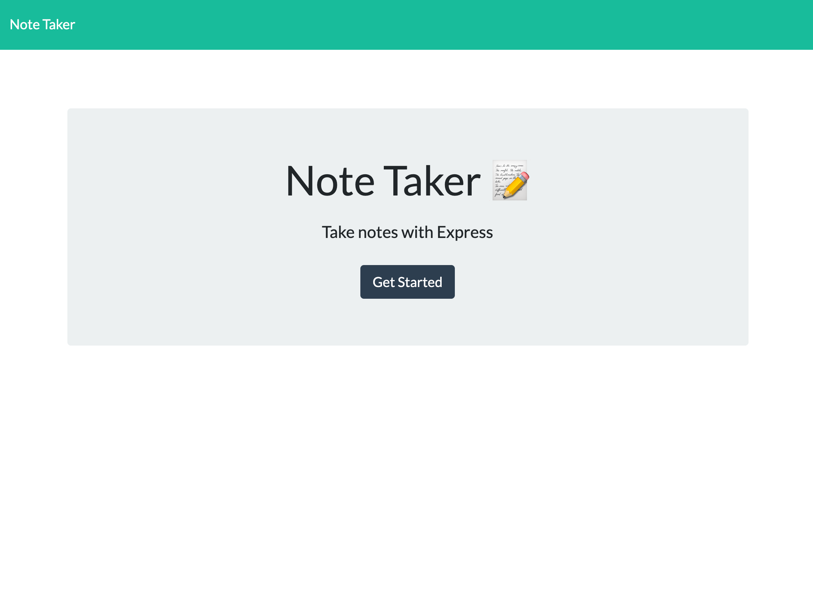
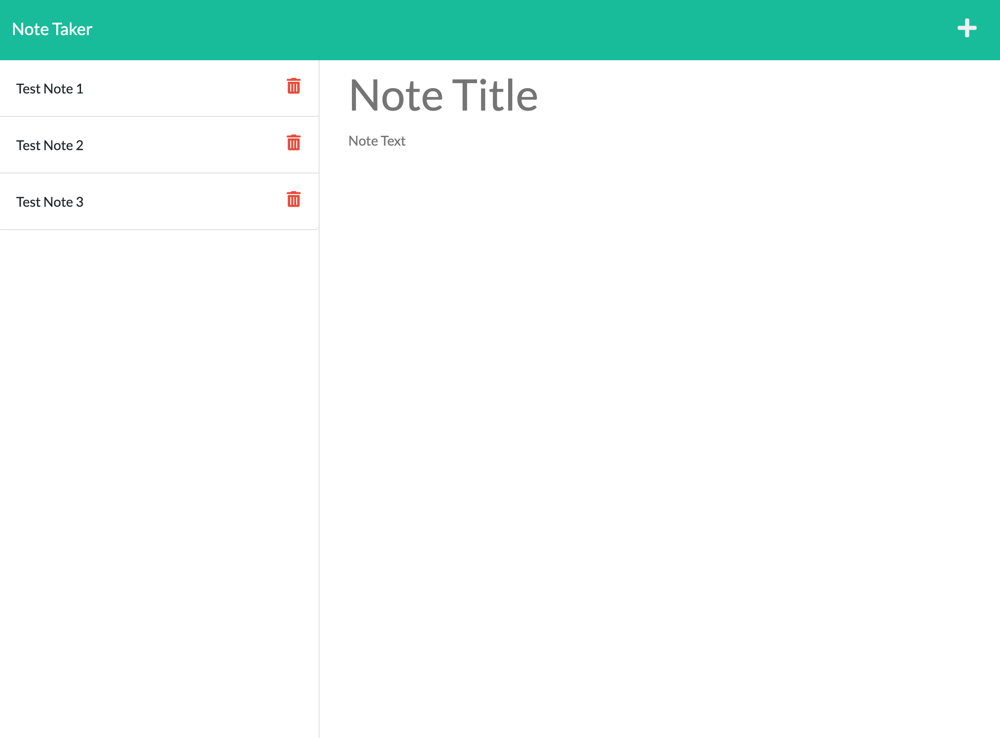

# Note Taker

## Description: 
> An application that allows users to write, save and delete notes with ease.

## Table of Contents
* [Installation](#Installation)
* [Usage](#Usage)
* [Questions](#Questions)

## Installation:
To install the application clone the repository and run 'npm i' in the command line to install dependencies.

## Usage:

Link to deployed application: https://note-taker-crg.herokuapp.com/

Screenshots of application:

## Questions:
GitHub: [crossigarcia](https://github.com/crossigarcia) 

For additional information on this project you can email your questions here: <cecilia.rossi.garcia@gmail.com>  